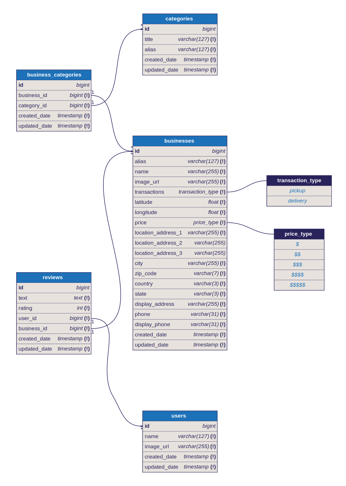

# Bizsearch - Business Search API Server

An API server to manage and find businesses and reviews

## Requirement

[Read documents here](./documents/README.md)

## Database ERD

## Todo

- [X] Design database schema
- [ ] Design APIs
- [ ] Initiate Backend
- [ ] Finish Backend
	- [ ] Database Migrations
	- [ ] Database Seeding
	- [ ] Database Query
	- [ ] APIs

## Setup

1. Run `pnpm install` to setup NodeJS depedencies

## Scripts

- `pnpm dbml:render` to render dbml into svg image
- `pnpm dbml:validate` to validate dbml definition

## Depedencies

- [dbml-renderer](https://github.com/softwaretechnik-berlin/dbml-renderer) to render dbml file into a svg image
